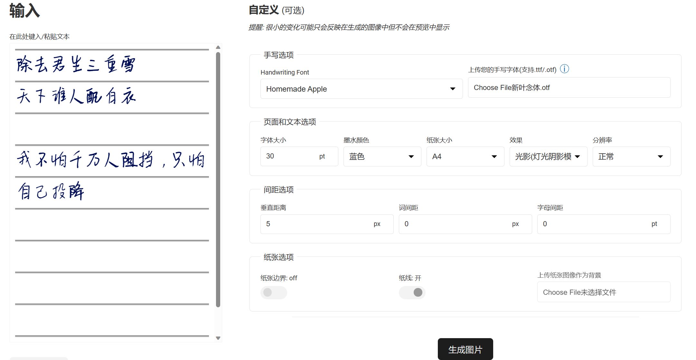
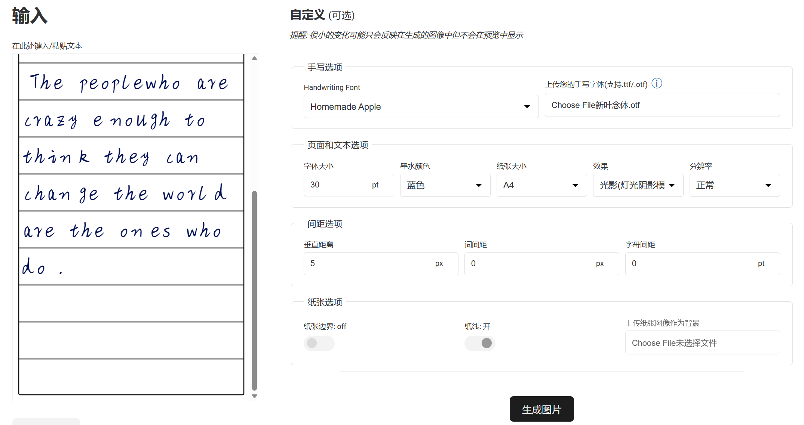

# 功能介绍

Text to Handwriting可将普通文本转换为手写文本，包括中文字体。支持自定义字体大小、墨水颜色、页面大小、字体间距、纸张背景等属性。除此之外，还能上传自己的字体。此项目是基于[原项目](https://github.com/saurabhdaware/text-to-handwriting)的二开，增加更多选项并做了汉化。

在线网址：https://jici-zeroten.github.io/text-to-handwriting/

# 项目截图





# 项目配置

```
git clone https://github.com/Jici-Zeroten/text-to-handwriting.git
cd text-to-handwriting
npm install
npm run dev
```

# 其他说明

- 如果您想要使用自己的手写字体，可以使用类似如下的网址，将自己的手写体转为字体

```
https://www.calligraphr.com/en/
```

- 下面是一些字体网站，可以下载字体【Tips：在使用字体时，请留意版权。请勿侵权使用(在实际商用时，建议联系版权方/作者再次核实)，侵权所导致的法律问题与本项目及相关人员无关】

```
https://www.hellorf.com/font?utm_source=zcool&utm_medium=index&utm_campaign=navigation&utm_content=font
https://wordshub.github.io/free-font/
https://github.com/wordshub/free-font
https://fonts.google.com/
https://51font.17font.com/font/---1-%E6%89%8B%E5%86%99
https://www.100font.com/search.htm?keyword=%E6%89%8B%E5%86%99
https://www.dafont.com/new.php
https://www.fontspace.com/search?q=handwriting
https://www.miao3.cn/
```
